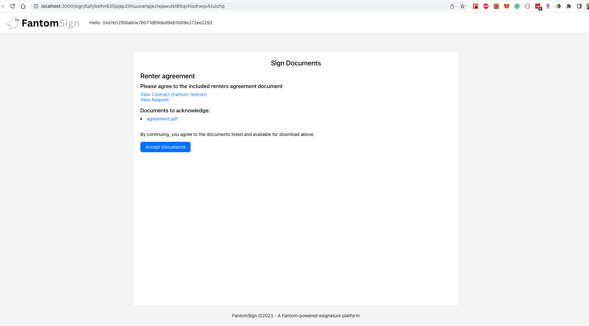

 

    

 
 

FantomSign
---

FantomSign is a web3 implementation of esignature collection built on Fantom smart contracts and IPFS. 

<!-- FantomSign is a distributed esignature application backed by Fantom Smart Contracts -->

Enables Docusign-like capabilities and use-cases using web3 infrastructure.

Submitted to the Fantom Q1 hackathon 2023 on devpost.

Try it out <a href="https://fantomsign.surge.sh" target="_blank">here</a>! (requires Metamask connected to Fantom testnet or mainnet).

Demo video: 

### Benefits

- FantomSign enables anyone to create and collect esignature against documents without a vendor agreement. A fantom smart contract is deployed for each request.
- Each packet of documents for esignature is made accessible at an IPFS url.
- When the esignature is completed, an NFT is generated that links both the signer's signature and the documents being agreed on.
- Hosted documents and the request are immutable.
- Smart contract deployed on Fantom which marks the progress/fulfillment of the esignature request. The contract can only be marked completed by the designated signer address at time of final signature.
- View history of requests and completed esignatures using the covalent chain history API directly from the app.
- An individual in the context of the FantomSign application is the pairing of a canvas (handwritten) signature and wallet signature/address.

### Technologies used

- Covalent: Enables in-app history queries of past esignature requests and fulfillment for a given fantom address.
- NFTPort: Generation of the esignature record / proof. Attaches the final esignature/agreement to an NFT and saves a link to it in the smart contract.
- Fantom: In-app deployment of the request smart contract and marked completed upon completion of the each request based on receival of signer's signature. A new Fantom contract is deployed for each new esignature request.

<!-- <b>This project is a hackathon prototype and would require additional work / deployment to be production ready. -->

---

To run/demo the project locally, FantomSign requires the following environment variables.

<pre>
    REACT_APP_COVALENT_KEY={YOUR_COVALENT_API_KEY} # Covalent key for the transaction history page.
    REACT_APP_NFT_PORT_KEY={YOUR_NFT_PORT_API_KEY} # NFT port api key for receipt creation.
    REACT_APP_STORAGE_KEY={YOUR_WEB3_STORAGE_KEY} # web3.storage key for file hosting.
</pre>

---

After declaring the above environment variables, use the below command to start the project:
`yarn; yarn start`

Recompiling FantomSign contract:
`cd contracts; npx hardhat compile`

Example esignature requests contracts:
http://localhost:3000/sign/QmUAS9XJyf9gPgadoVeExESiVnVJmVJW6qtcU4dzJzwG96

### Useful links
* Testnet faucet: https://faucet.fantom.network/
* Covalent blockchain history (compatible with Fantom): https://www.covalenthq.com/docs/networks/fantom/
* Fantom dev docs: https://docs.fantom.foundation/

<!--
Sponsors:
Fantom - Deploys a smart contract for esign.
Covalent - Signature history.
NFTport - Signature NFT creation on fantom.

Demo flow:
Show docusign site / discuss industry baseline
Show FantomSign.
Create an esign request
Submit (Can be metamask or sequence wallet)
Show result (fantom contract)
View the completed assets (fantom, contract interaction, nftport)
History page (covalent, look up a given contract owner's request/collection history)
Github

-->

### Screenshots

#### Home page

#### Creating a request

### Request saved via IPFS (both the docs and request metadata).

### Esigning

### Both the creation of the request and the signature get saved as events on a smart contract

### Completion esignature NFT

### Deployed Contract

### Contract source

### Viewing signing history via Covalent.

